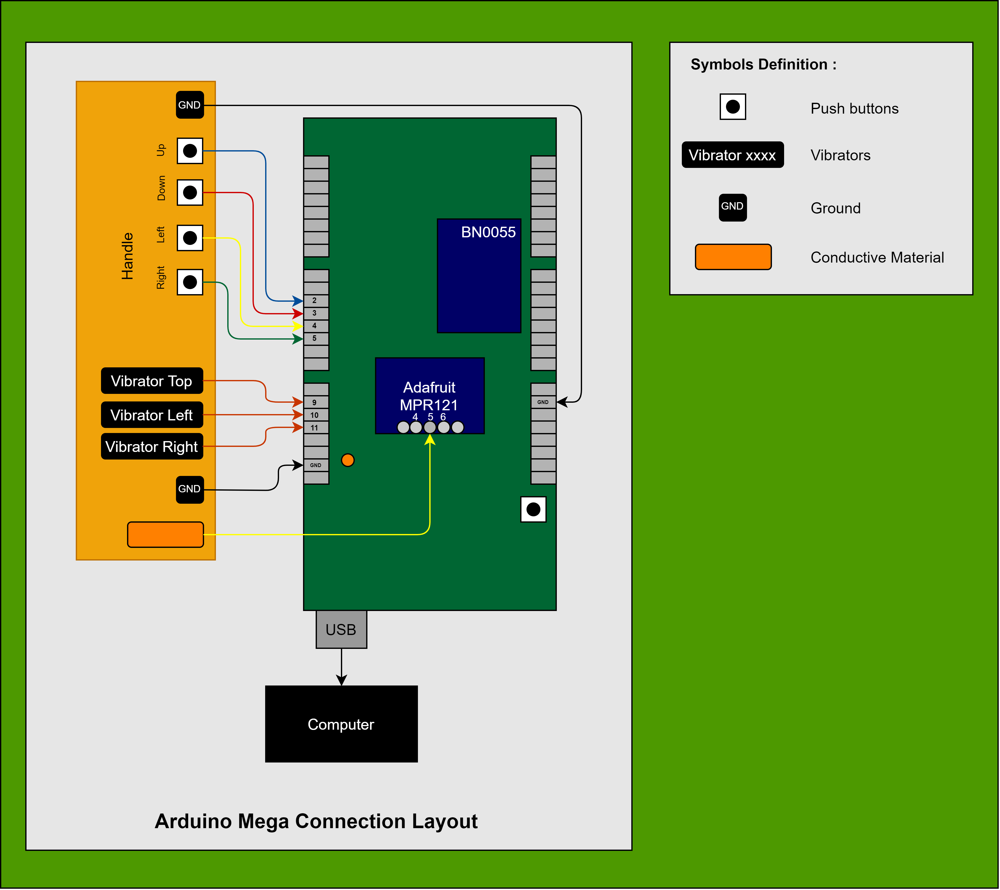

[](https://opensource.org/licenses/MIT)

# Cabot-E-Arduino

## Pre-requisites

In order to run ROS on Arduino Mega 2560, you will need both the Arduino IDE as well as ROS Serial Arduino Library. Please follow the instructions on the following page for installing these requirements:
[Installation instructions](http://wiki.ros.org/rosserial_arduino/Tutorials/Arduino%20IDE%20Setup)

<font color = "blue">After installing Arduino IDE, please make sure to open the IDE at least once before proceeding to the next steps.</font>

The following packages are essential for letting the touch sensor, push buttons and vibrator communicate with Arduino Mega 2560. Please open a new terminal and copy-paste the following instructions:
```
cd ~/Arduino/libraries
git clone https://github.com/adafruit/Adafruit_BNO055.git
git clone https://github.com/adafruit/Adafruit_Sensor.git
git clone https://github.com/adafruit/Adafruit_ADXL343.git
git clone https://github.com/adafruit/Adafruit_MPR121.git
git clone https://github.com/JChristensen/Timer.git
git clone https://github.com/frankjoshua/rosserial_arduino_lib.git
rosrun rosserial_arduino make_libraries.py ~/Arduino
```

## Assembly instructions

The following figure explains the manner in which the touch sensor, push buttons and vibrators are supposed to be connected with Arduino Mega 2560.

<p align="center">
  
</p>

## Components description

- The Cabot's handle has three main features namely, touch sensor, push buttons (four of them), and vibrators (three of them).
- The touch sensor is used for giving user feedback to the robot while it is moving, to ensure that the robot moves along with the user without getting lost.
- The three vibrators are useful for giving alerts to the user in response to obstacles encountered in the front and on the sides of the robot while it is moving.
- The four push butons are useful for giving manual input signals to the robot, to command it to move in preferred directions (forward, backward, left turn, and right turn).
- The touch sensor is usually a thin film of conductive material like Copper (Cu).

## Related repositories

The Arduino shield used in this project is derived from an earlier project found in this repository: https://github.com/RealCabot/simplePCB.git