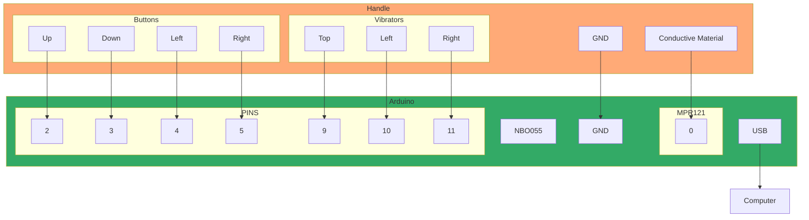

```mermaid
flowchart TB
    subgraph Arduino
      subgraph MPR121
      MPR121-0[0]
      end
    NBO055
    USB
    A-GND[GND]
    subgraph PINS
    2
    3
    4
    5
    9
    10
    11
    end
    end
    Computer
    subgraph Handle
      subgraph Vibrators
      V-Top[Top]
      V-Left[Left]
      V-Right[Right]
      end
      subgraph Buttons
      B-Up[Up]
      B-Down[Down]
      B-Left[Left]
      B-Right[Right]
    end
    H-GND[GND]
    Conduct[Conductive Material]
    end
    Conduct-->MPR121-0
    USB-->Computer
    V-Top-->9
    V-Left-->10
    V-Right-->11
    B-Up-->2
    B-Down-->3
    B-Left-->4
    B-Right-->5
    H-GND-->A-GND
    style Handle fill:#fa7
    style Arduino fill:#3a6
```